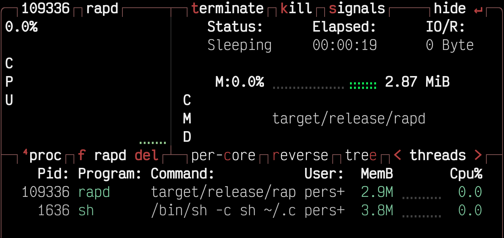
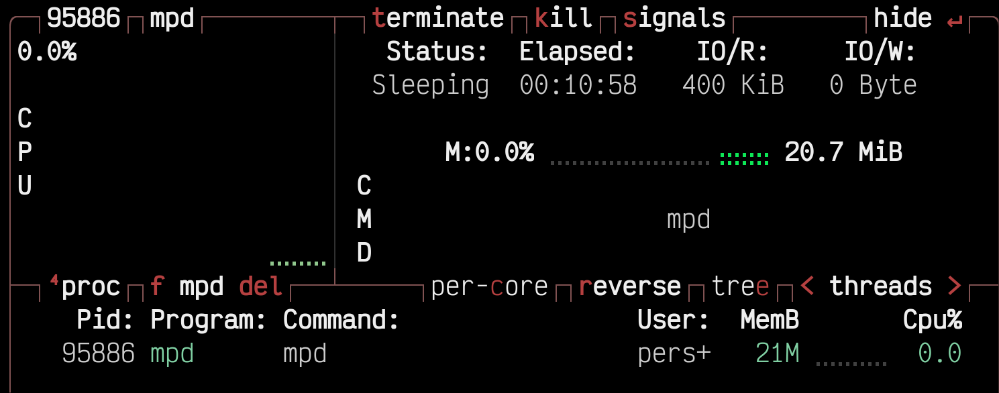
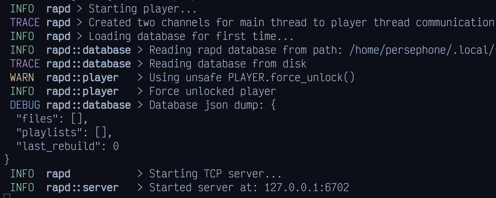

---
  hide:
    - toc
    - navigation
---

<link rel="stylesheet" href="assets/index.css">

<section class="fusion-home-landing">
    <h1>Rust audio player daemon</h1>
    <p>
      RAPD is a media player daemon that runs in the background, and accepts TCP connections
      to control its built in media player. The benefit of this is low resource usage, and 
      independent music storage.
    </p>
    <nav>
        <a href="install" class="arrow-link">Manual</a>
        <a href="https://github.com/Interfiber/rapd/releases" class="arrow-link external-link">Download latest</a>
    </nav>
</section>

<section class="fusion-home-float">
    <h2>Low resource usage</h2>
    <p>
      RAPD is built in rust for speed, and saftey. Also since RAPD does not run a fancy
      user interface it can run with low CPU, and memory use in the background.
    </p>
</section>

=== "RAPD at idle"


    {: width="600" height="600" }

=== "MPD at idle"

    {: width="600" height="600" }

-----

<section class="fusion-home-float">
    <h2>Easily configurable</h2>
    <p>
        RAPD does not have a config file. Instead it has an auto launch script,
        here you can use rapc to set your configuration. You can also do this during runtime
    </p>
</section>

```Bash

# set your music directory
rapc config set music_dir $HOME/Music

# set the packet format to be binary
rapc config set packet_format bin

# set the packet format to be json
rapc config set packet_format json

# enable notifications
rapc config set notifications_enabled true

```

-----

<section class="fusion-home-float">
    <h2>Minimal</h2>
    <p>
      RAPD is minimal, is has no gui by default, and has no ultra-complex features. Its just a music player
    </p>
</section>

{: width="600" height="600"}
